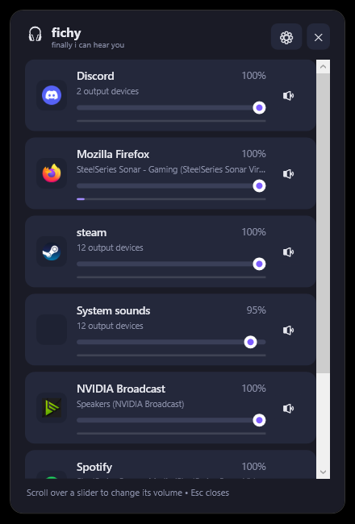
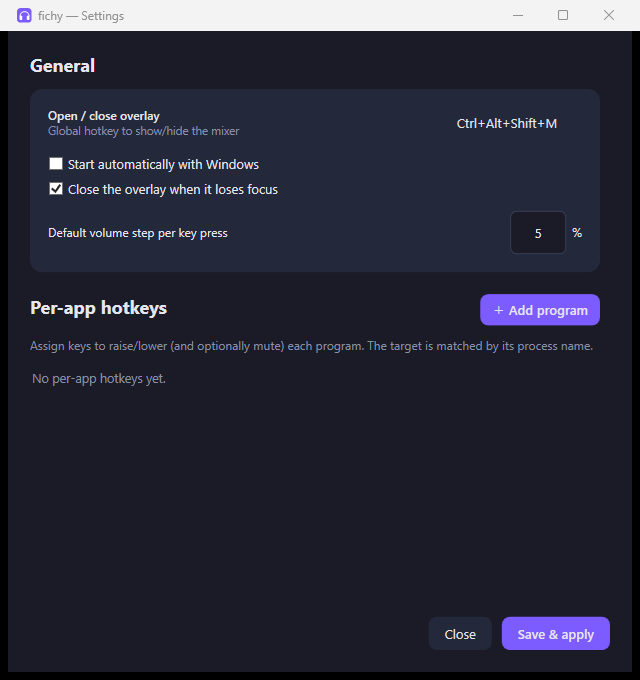

<div align="center">


# fichy

**f**inally **i** **c**an **h**ear **y**ou

A tiny Windows per‑app volume mixer with a global **hotkey overlay** and **custom hotkeys** to turn individual programs up or down. Ships as a single `.exe`, lives in the tray, optional autostart.

[](../../releases/latest)
&nbsp;




</div>

---

## Why

Windows lets you set per‑app volume — but it's buried in Settings, there's no global shortcut, and you certainly can't bind "turn Spotify down" to a key. **fichy** fixes exactly that: pop the mixer with one hotkey, or wire up your own keys so a single press makes a specific app louder, quieter, or muted — without leaving your game or video.

## Features

- 🎚️ **Every audio output source** — enumerates all active render devices via the Windows Core Audio API (WASAPI) and shows one row per program, aggregated across *all* devices (just like the Windows mixer).
- ⌨️ **Overlay on a hotkey** — show/hide the mixer from anywhere. Default: `Ctrl+Alt+Shift+M`.
- 🎯 **Custom per‑app hotkeys** — bind *louder* / *quieter* / *mute* keys per program with an adjustable step. A quick on‑screen display shows the change.
- 🖱️ **Live sliders & peak meters** — scroll over a slider to change its volume; watch real‑time levels.
- 📦 **One single `.exe`** — self‑contained, no .NET install required.
- 🚀 **Autostart** — one checkbox (per‑user registry, no admin rights).
- 🌐 **Layout‑aware** — hotkey labels follow your active Windows keyboard layout, so what you see matches what you press.
- ⚠️ **Honest about conflicts** — if a hotkey is already taken by another app, fichy tells you instead of silently failing.

## Install

1. Grab **`fichy.exe`** from the [latest release](../../releases/latest).
2. Run it. It drops into the **tray** (bottom‑right). On first launch, **Settings** opens automatically.
3. That's it — no installer, no dependencies.

## Usage

| Action | How |
|--------|-----|
| **Open the overlay** | Press `Ctrl+Alt+Shift+M`, or double‑click the tray icon |
| **Open settings** | Right‑click the tray icon → *Settings…* |
| **Change overlay hotkey** | Click the hotkey field in Settings, then press your combo (Backspace/Del clears, Esc cancels) |
| **Add a per‑app hotkey** | Settings → *＋ Add program* → pick a program (`▼` lists what's currently playing) → assign *Louder / Quieter / Mute* |
| **Enable autostart** | Settings → *Start automatically with Windows* |

Config is stored at `%AppData%\fichy\settings.json`.

<div align="center">

</div>

## Build from source

Requires the [.NET 9 SDK](https://dotnet.microsoft.com/download).

```bash
git clone https://github.com/clnnlc/fichy.git
cd fichy

# run for development
dotnet run

# produce the single self-contained .exe
dotnet publish -c Release
# -> bin/Release/net9.0-windows/win-x64/publish/fichy.exe
```

## How it works

| Concern | Approach |
|---------|----------|
| Per‑app volume | [NAudio](https://github.com/naudio/NAudio) over WASAPI (`IAudioSessionManager2` / `ISimpleAudioVolume`) |
| Global hotkeys | Win32 `RegisterHotKey` on a message‑only window |
| Layout‑correct key labels | `ToUnicodeEx` against the active keyboard layout |
| Autostart | `HKCU\…\CurrentVersion\Run` |
| Overlay / OSD | Borderless, top‑most WPF windows |
| Tray icon | `NotifyIcon`, drawn at runtime |

### Project layout

```
Model/       AppSettings, VolumeBinding, HotkeyGesture   (config model)
Services/    AudioManager, AudioSession, SessionGroup    (WASAPI + per-app aggregation)
             HotkeyManager, KeyNames                     (global hotkeys, layout labels)
             AutostartService, SettingsService, Logger
UI/          OverlayWindow, SettingsWindow, OsdWindow, HotkeyBox
Themes/      Dark.xaml                                   (dark theme + control styles)
```

### Troubleshooting

Launch with the `FICHY_LOG` environment variable set to write a diagnostic log to `%AppData%\fichy\log.txt`:

```powershell
$env:FICHY_LOG=1; .\fichy.exe
```

## Tech

**C# / .NET 9 + WPF** — the natural fit for per‑application audio control on Windows, since it's the only clean way to reach WASAPI's session API, while keeping global hotkeys, a tray icon, autostart and a single‑file build all native.

## License

[MIT](LICENSE)
